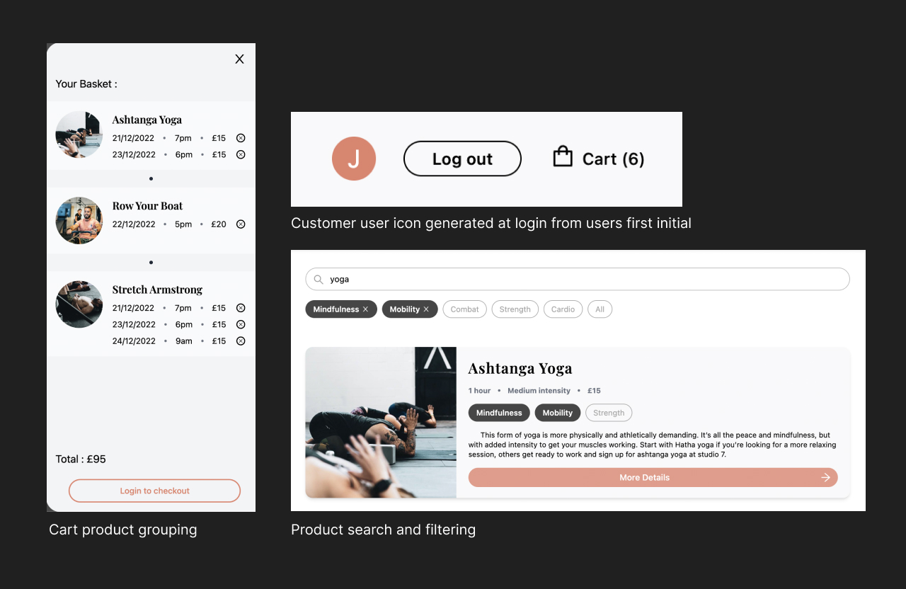

# Studio 7 - E-Commerce Website

An e-commerce website designed and build for a fictitious south London fitness studio, where users can book themselves into, and pay for classes.

## Table of contents

- [Overview](#overview)
  - [About](#about)
  - [Screenshot](#screenshot)
  - [Links](#links)
- [My process](#my-process)
  - [Built with](#built-with)
  - [What I learned](#what-i-learned)
  - [Continued development](#continued-development)
  - [Useful resources](#useful-resources)
- [Author](#author)

## Overview

### About

- Studio 7 is a fully responsive Next.js site deployed with Vercel. 

- The products a managed by Sanity CMS and the Classes page allows users to search for classes using the search bar and stackable filters. The site will display results that meet the criteria of both the search term and the applied filters. 

- The site uses react context to keep track of the user’s cart, which can be accessed at any time by clicking the cart icon. I coded the cart to group classes of the same type together under one heading for a better user experience, instead of listing each individual class separately.

- Auth0 is implemented to allow users to log in with their Google accounts.

- Stripe payment management allows users to checkout their carts and pay for the classes added. 

- The site is styled with Tailwind and features Framer Motion animations

### Screenshot

### Links

- [Live site](https://www.studio-7.net/)

## My process

### Built with

- Next.js
- Tailwind
- Framer Motion
- Sanity CMS
- Auth0
- Stripe payment management

### What I learned

This Project really cemented my knowledge of using headless CMS.

This was an extremely enjoyable project and I found e-commerce to be an especially interesting and challenging field. 

I learned how to use many technologies I hadn't used before such as Auth0 and Stripe payment management.

This project also broadened my knowledge of Next.js and React, specifically react context and the useContext hook.

### Continued development

I would like to see this project offer the user a calendar, with their classes plotted into their respective dates. I would also like to add a user dashboard where a user can see their specific attendance stats and earn badges etc. based on classes attended. This is definitely something I would like to revisit at some point or implement in another project.

### Useful resources

- [Stripe Docs](https://stripe.com/docs) - The Stripe documentation proved invaluable when working on the payment portion of the site. I found the documentation clear and helpful and could not have completed this project without it. 
- [Framer Motion Tutorial - LogRocket](https://blog.logrocket.com/framer-motion-tutorial/) - This article by Glyn Lewington was really helpful when using Framer Motion to add animations to the About section of the site. The article covers all the basics of setting up your animations and provided me with all I needed to create my animations.

## Author

Jacob Dunbar
[jacobdunbar.com](https://www.jacobdunbar.com)
